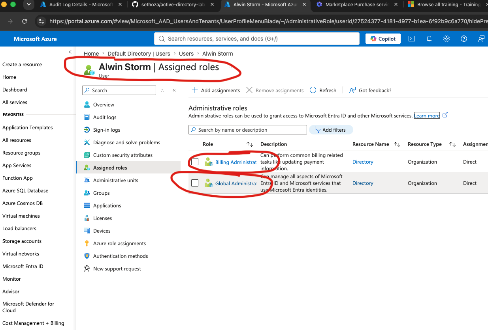
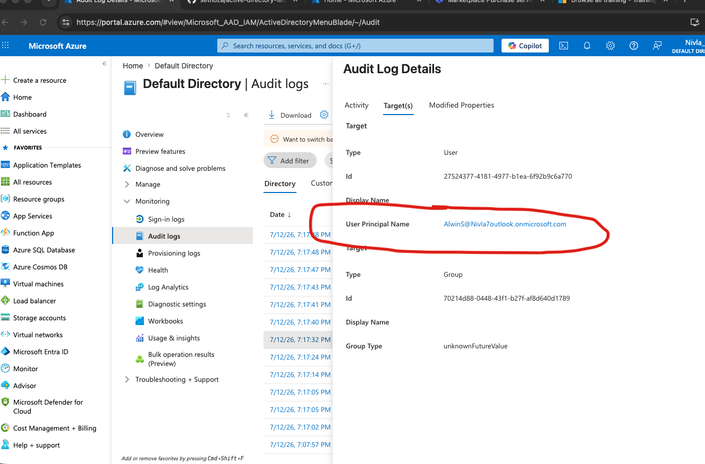

# Lab 01: Implementing RBAC (and Wrestling Cloud Portals)

## 1. The Objective & Business Problem
**Risk:** Handing out "Global Admin" rights to everyone is how companies end up on the evening news. Giving users too much access violates the principle of least privilege and massively increases the blast radius if an account gets popped. 
**Solution:** Enforce strict Role-Based Access Control (RBAC). We create dedicated Security Groups (like "Marketing") and assign limited, specific roles to those groups. No more handing out the master keys to the whole kingdom.
**Compliance Mapping:** NIST CSF 2.0 (PR.AA-05) and NIST 800-53 (AC-6).

## 2. Technical Implementation 
The cloud fought back with a few administrative roadblocks, but I successfully separated the directory from the billing duties and executed the following:
- **Hurdle:** Encountered a standard automated fraud-prevention block; Microsoft placed a 2-day security review on the new lab tenant before releasing the premium P2 licenses. 
- **Pivot:** Adapted to the constraint and built out the foundational RBAC architecture using the Entra ID Free tier instead of stalling the project.
- Spun up a new identity (Alwin Storm).
- Created a fresh Security Group named "Marketing" and added Alwin to the roster.
- Navigated the Entra ID RBAC matrix to grant the exact permissions required for the job, bypassing the default Global Admin trap.

## 3. Verification & Defense Proof 
If it's not in the logs, it's a rumor. Verifying directory changes is critical for tracking insider threats or compromised credentials. 
- Queried the Entra ID Audit Logs and cut through the background noise using targeted filters.
- Isolated the "Add member to group" activity.
- Checked the `Target(s)` tab to explicitly verify the User Principal Name (UPN). 

**What I Learned**

Learned that defaulting to Global Admin is the fastest way to turn one stolen password into a company-wide disaster — convenient until the audit logs start screaming. By spinning up a dedicated Marketing security group, adding the test user, and scoping permissions down to Billing Administrator instead of the nuclear option, I saw least privilege actually work in a live tenant. Most importantly, querying the Entra ID audit logs and confirming the exact User Principal Name on the "Add member to group" event proved why audit logs are the backbone of any real investigation: if you can't trace it, you can't defend it.  
